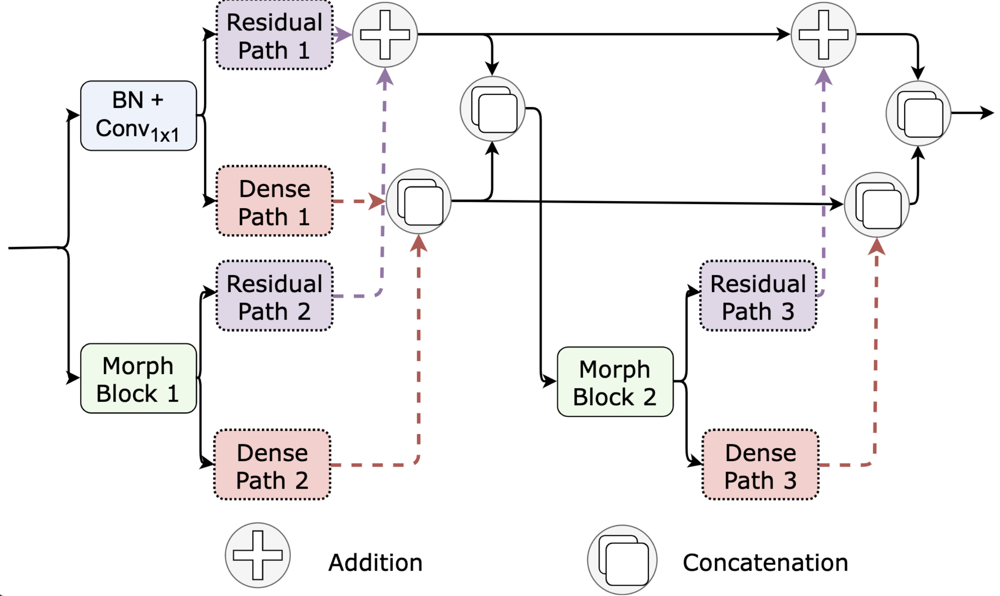
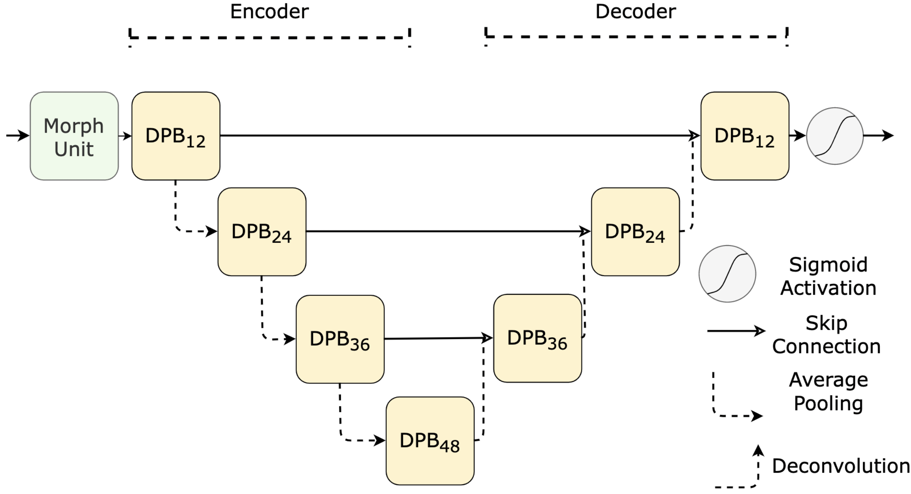

# Dual Path Morph-UNet 

This repository contains the official Tensorflow implementation of the Dual Path Morph-UNet as described in the paper "Dual Path Morph-UNet for Road and Building Segmentation from Satellite Images". 

## Overview
In this work we attempt to incorporate classical image processing with learning-based methods for remote sensing to increase the model's interpretability and accuracy. We propose Dual Path Morph-UNet, a novel network, for road and building segmentation to achieve better results, wherein learnable 2D morphological operations replace convolutions. The network performance is streamlined by incorporating parallel dense and residual paths for efficient information propagation, resulting in lower feature redundancy. Our network outperforms the state-of-the-art method significantly on object segmentation by utilizing multi-scale high-level morphological features with only 0.4 million parameters. Furthermore, the architecture's highly modular structure makes it suitable for other domains with minimal changes required. 

## Network Architecture

<p align="left">
  
   
</p>

Please cite our paper if you find the code useful 

```
@article{dey2021dual,
  title={Dual-Path Morph-UNet for Road and Building Segmentation From Satellite Images},
  author={Dey, Moni Shankar and Chaudhuri, Ushasi and Banerjee, Biplab and Bhattacharya, Avik},
  journal={IEEE Geoscience and Remote Sensing Letters},
  year={2021},
  publisher={IEEE}
}

```
